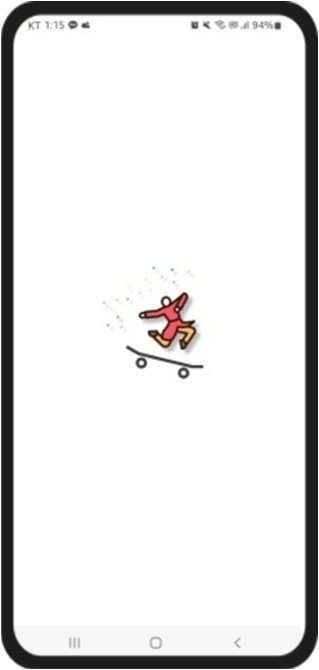
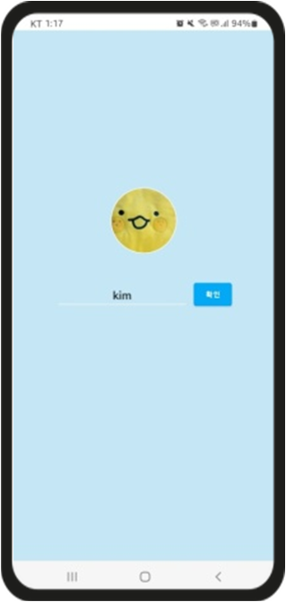
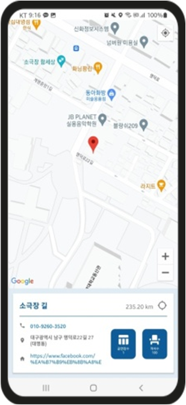
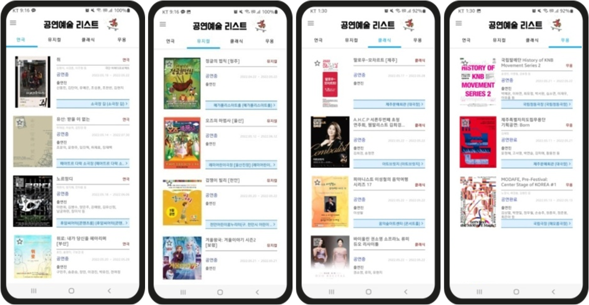
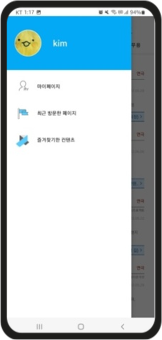

# 📅 [ 공연예술리스트 Culturelist (Android Native App) ] 
### 🎯 안드로이드 네이티브 앱 1인 제작 프로젝트 
* Open API를 활용하여 일정 기간 내에 공연시작/종료일이 포함되는 공연의 정보를 장르별로 표시하는 앱 제작

* <strong>앱 배포 마켓 주소 : https://play.google.com/store/apps/details?id=com.grinleaf.tp14librarysearch</strong>

## 📝 <strong>프로젝트 개요</strong>
1. 프로젝트 명 : 공연예술리스트 Culturelist
2. 개발 기간 : 2022.03.11 ~ 03.24 (2주)
3. 개발 인원 : 1인
4. 개발 목표
   * 오픈 API 데이터 파싱 작업 연습
   * 다양한 레이아웃 구성 연습
6. 담당 역할 : 기획, 디자인, 레이아웃 설계, 기능 개발
7. 개발 환경

|OS|개발도구|개발언어|DB|
|:------:|:---:|:---:|:--:|
|Window 10|Android Studio|Java|Firebase, Dothome

## 🛠 <strong>주요 구현기술</strong>
* 동적 퍼미션 허가 요청 작업
* Open API – 멀티 스레드를 이용한 데이터 파싱 작업
* Google Map API를 이용한 위치 기반 서비스 작업
* SharedPreference로 사용자 프로필 이미지, 닉네임 저장
* 기본적인 RecyclerView, ActionBar 등을 활용한 레이아웃 구성
* Firebase Storage, Firestore 를 이용한 사용자 계정 관리

## 📌 사용된 라이브러리
* 원형 이미지뷰 라이브러리 : CircleImageView(hdodenhof)
* 이미지 로드 라이브러리 : Glide(bumptech)
* Firebase SDK : storage, firestore
  
# ⛏ <strong>작업 코드 및 실행화면 🔨</strong>

## 📱  <strong>앱 주요 실행화면</strong>
|인트로 화면|로컬 프로필/닉네임 저장화면|사이드메뉴화면|
|:---:|:---:|:---:|
||||

|공연정보 출력화면|공연장 상세정보 화면|
|:---:|:---:|
|||
